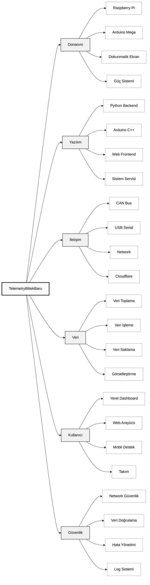

# TelemetryBiltekBaru

Bu proje, TÜBİTAK Efficiency Challenge 2025 kapsamında `Efekan Nefesoğlu` tarafından geliştirilen elektrikli araç telemetri ve veri izleme sistemidir. Proje, aracın performans verilerini gerçek zamanlı olarak izlemek, kaydetmek ve görselleştirmek için tasarlanmıştır.

## 💻 Donanım Özellikleri

### Ana Sistem
- **İşlemci:** Raspberry Pi 4B (2GB RAM)
- **İşletim Sistemi:** Raspberry Pi OS (64-bit)
- **Depolama:** 16GB MicroSD Kart 
- **Ekran:** Waveshare 11.9inch Capacitive 320×1480 Touch Screen LCD Display
- **Güç:** 5V/3A USB-C Güç Kaynağı
- **Mikrodenetleyici:** Arduino Mega 2560
- **CAN Bus Shield:** MCP2515 CAN Bus Modülü
- **Bağlantı:** USB Serial (Arduino-RPi), CAN Bus (Arduino-Araç)

## 🛠️ Teknoloji Stack

### Backend
- **Python 3.x** - Ana programlama dili
- **PyQt5** - Desktop GUI framework
- **Flask** - Web framework
- **PySerial** - Seri port iletişimi
- **Threading** - Çoklu işlem yönetimi

### Frontend (Web Arayüzü)
- **HTML5** - Web yapısı
- **CSS3** - Stil ve animasyonlar
- **JavaScript** - İnteraktif özellikler
- **Fetch API** - AJAX istekleri

### Donanım İletişimi
- **CAN Bus Protokolü** - Araç ECU'larından veri toplama (250 kbps)
- **CAN Bus Shield** - Arduino için CAN Bus arayüzü
- **Seri Port Protokolü** - Arduino-Raspberry Pi iletişimi (115200 bps)
- **JSON** - Veri formatı ve Arduino-RPi protokolü

### Altyapı
- **Cloudflare Tunnel** - Güvenli uzaktan erişim
- **Systemd** - Servis yönetimi (Linux)
- **Git** - Versiyon kontrolü

## 🏗️ Sistem Mimarisi

```mermaid
graph TB
    subgraph "Araç CAN Bus Sistemi"
        CAN["CAN Bus Network<br/>🚗 Araç Ana Veri Yolu"]
        ECU1["Motor ECU<br/>• Motor Sıcaklığı<br/>• Motor RPM<br/>• Güç Kullanımı"]
        ECU2["Batarya ECU<br/>• Batarya Sıcaklığı<br/>• Hücre Voltajları<br/>• Şarj Durumu"]
        ECU3["Şasi ECU<br/>• Araç Hızı<br/>• Fren Durumu"]
        ECU4["Gövde ECU<br/>• Far Durumu<br/>• Kör Nokta<br/>• Park Sensörü"]
        
        ECU1 --> CAN
        ECU2 --> CAN
        ECU3 --> CAN
        ECU4 --> CAN
    end
    
    subgraph "Veri Toplama Katmanı"
        ARDUINO["Arduino Mega 2560<br/>🔌 CAN Bus Shield<br/>• CAN Bus Okuma<br/>• Veri Filtreleme<br/>• JSON Formatı"]
    end
    
    subgraph "Ana İşlem Katmanı (Raspberry Pi 4B)"
        SERIAL["Serial Reader<br/>• Veri Alma<br/>• Doğrulama<br/>• Buffer Yönetimi"]
        DASHBOARD["Dashboard UI<br/>• PyQt5 Arayüzü<br/>• Gerçek Zamanlı Gösterim<br/>• Uyarı Sistemi"]
        FLASK["Flask Web Server<br/>• API Endpoint'leri<br/>• Web Arayüzü<br/>• JSON Response"]
        LOGGER["Logger System<br/>• Veri Kayıt<br/>• Hata Loglama<br/>• CSV/JSON Export"]
    end
    
    subgraph "Uzaktan Erişim"
        CLOUDFLARE["Cloudflare Tunnel<br/>• SSL/TLS Şifreleme<br/>• DNS Yönetimi<br/>• DDoS Koruması"]
        WEB["Web Interface<br/>📱 Responsive Design<br/>• HTML5/CSS3/JS<br/>• Real-time Updates"]
    end
    
    subgraph "Kullanıcılar"
        LOCAL["🖥️ Yerel Kullanıcı<br/>Dashboard Ekranı<br/>1480x320 Display"]
        REMOTE["🌐 Uzak Kullanıcılar<br/>Web Browser<br/>Takım & Teknisyenler"]
    end
    
    CAN -->|CAN Protocol<br/>250 kbps| ARDUINO
    ARDUINO -->|USB Serial<br/>115200 bps<br/>JSON Format| SERIAL
    SERIAL --> DASHBOARD
    SERIAL --> FLASK
    DASHBOARD --> LOCAL
    FLASK --> LOGGER
    FLASK --> CLOUDFLARE
    CLOUDFLARE -->|HTTPS<br/>ecar.efekannefesoglu.com| WEB
    WEB --> REMOTE
    
    style ARDUINO fill:#911500
    style CAN fill:#020770
    style CLOUDFLARE fill:#004f16
    style WEB fill:#af6000
    style LOCAL fill:#c300e5
    style REMOTE fill:#004684
```



## 🧠 Proje Bileşenleri Haritası



## 📊 Veri Formatı ve Protokol

### Arduino Veri Paketi Formatı

#### JSON Veri Şeması
```json
{
  "speed": 60,                // Araç hızı (km/h) - Integer (0-220)
  "battery_level": 75,        // Pil seviyesi (%) - Integer (0-100)
  "battery_temp": 28,         // Pil sıcaklığı (°C) - Float (0-80)
  "motor_temp": 42,           // Motor sıcaklığı (°C) - Float (0-120)
  "power_usage": 15,          // Anlık güç kullanımı (kW) - Float (0-150)
  "regen_power": 0,           // Rejeneratif frenleme gücü (kW) - Float (0-50)
  "headlights": 1,            // Far durumu - Integer (0: kapalı, 1: kısa, 2: uzun)
  "left_blind_spot": false,   // Sol kör nokta uyarısı - Boolean
  "right_blind_spot": false,  // Sağ kör nokta uyarısı - Boolean
  "aks_enabled": true,        // AKS aktif mi? - Boolean
  "odometer": 12500,          // Kilometre sayacı - Integer (0-1000000)
  "pack_voltage": 400,        // Batarya paketi voltajı (V) - Float
  "min_cell_voltage": 3.15,   // Minimum hücre voltajı (V) - Float
  "max_cell_voltage": 4.21,   // Maksimum hücre voltajı (V) - Float
  "instant_power": 20,        // Anlık güç (kW) - Float
  "average_power": 15         // Ortalama güç (kW) - Float
}
```

#### Veri İletişim Protokolü
- **Format:** JSON over Serial
- **Baudrate:** 115200 bps
- **Delimiter:** Her veri paketi `#END#` ile sonlandırılır
- **Encoding:** UTF-8
- **Timeout:** 1 saniye
- **Buffer Size:** 4096 bytes

### API Endpoint'leri

#### 1. Ana Sayfa
- **URL:** `/`
- **Method:** GET
- **Description:** Web dashboard arayüzünü döndürür
- **Response:** HTML sayfa

#### 2. Telemetri Verileri
- **URL:** `/telemetry`
- **Method:** GET
- **Description:** En güncel telemetri verilerini JSON formatında döndürür
- **Response Format:**
```json
{
  "timestamp": "2025-01-15T10:30:45.123Z",
  "data": {
    "speed": 60,
    "battery_level": 75,
    "battery_temp": 28,
    "motor_temp": 42,
    "power_usage": 15,
    "regen_power": 0,
    "headlights": 1,
    "left_blind_spot": false,
    "right_blind_spot": false,
    "aks_enabled": true,
    "odometer": 12500,
    "pack_voltage": 400,
    "min_cell_voltage": 3.15,
    "max_cell_voltage": 4.21,
    "instant_power": 20,
    "average_power": 15
  },
  "warnings": [
    {
      "type": "warning",
      "message": "Batarya sıcaklığı yüksek",
      "value": 55,
      "threshold": 60
    }
  ]
}
```

#### 3. Sistem Durumu
- **URL:** `/status`
- **Method:** GET
- **Description:** Sistem durumu ve bağlantı bilgileri
- **Response Format:**
```json
{
  "arduino_connected": true,
  "last_data_time": "2025-01-15T10:30:45.123Z",
  "uptime": "2h 15m 30s",
  "memory_usage": "45%",
  "cpu_usage": "12%"
}
```

## 📈 Performans ve Gereksinimler

### Sistem Gereksinimleri

#### Minimum Gereksinimler
- **RAM:** 1GB (2GB önerilen)
- **Depolama:** 8GB MicroSD Kart
- **İşlemci:** ARM Cortex-A72 (Raspberry Pi 4)
- **USB Port:** 1x USB 2.0/3.0
- **Ağ:** WiFi veya Ethernet

#### Performans Metrikleri
- **Veri İşleme Hızı:** ~100 veri paketi/saniye
- **Yanıt Süresi:** <50ms (Web API)
- **Bellek Kullanımı:** ~200MB (Dashboard + Web Server)
- **CPU Kullanımı:** ~15% (normal çalışma)
- **Ağ Trafiği:** ~1KB/saniye (telemetri verisi)

### Optimizasyon İpuçları

1. **Veri İşleme Optimizasyonu**
   - Buffer boyutunu artırın (4KB → 8KB)
   - Threading kullanarak paralel işlem yapın
   - Gereksiz veri doğrulamalarını azaltın

2. **Bellek Optimizasyonu**
   - Log dosyası boyutunu sınırlayın (max 100MB)
   - Eski log dosyalarını otomatik silin
   - Garbage collection'u optimize edin

3. **Ağ Optimizasyonu**
   - Veri sıkıştırma kullanın
   - Cache mekanizması ekleyin
   - Batch veri işleme yapın

## ❓ Sık Sorulan Sorular (FAQ)

### Genel Sorular

**S: Sistem kaç FPS ile çalışır?**
A: Dashboard ~30 FPS, web arayüzü ~10 FPS güncelleme hızında çalışır.

**S: Offline modda çalışabilir mi?**
A: Evet, Arduino bağlantısı olmadan test modu ile çalışabilir.

**S: Birden fazla kullanıcı aynı anda erişebilir mi?**
A: Evet, web arayüzü çoklu kullanıcı desteği sağlar.

### Teknik Sorular

**S: Arduino bağlantısı koptuğunda ne olur?**
A: Sistem otomatik yeniden bağlanmaya çalışır. Bağlantı kurulamadığında test verileri kullanılır.

**S: Cloudflare tüneli neden kullanılıyor?**
A: Güvenli uzaktan erişim, SSL sertifikası ve DDoS koruması için.

**S: Veri kayıtları ne kadar süre saklanır?**
A: Log dosyaları otomatik olarak 30 gün saklanır, sonra silinir.

### Sorun Giderme

**S: "Port bulunamadı" hatası alıyorum**
A: 
1. Arduino'nun bağlı olduğundan emin olun
2. Doğru port numarasını kontrol edin (`ls /dev/tty*`)
3. Kullanıcı izinlerini kontrol edin (`sudo usermod -a -G dialout $USER`)

**S: Web arayüzü açılmıyor**
A:
1. Flask sunucusunun çalıştığını kontrol edin (`ps aux | grep python`)
2. Port 8000'in açık olduğunu kontrol edin (`netstat -an | grep 8000`)
3. Firewall ayarlarını kontrol edin

**S: Veriler güncellenmedi**
A:
1. Arduino bağlantısını kontrol edin
2. Serial port hızını kontrol edin (115200 bps)
3. Log dosyalarını inceleyin (`tail -f logs/*.log`)

### Geliştirme Soruları

**S: Yeni sensör nasıl eklenir?**
A: 
1. Arduino koduna yeni sensör okuma ekleyin
2. JSON formatına yeni alan ekleyin  
3. Dashboard'da yeni gösterge oluşturun
4. Web arayüzünde görselleştirme ekleyin

**S: Özel uyarı nasıl eklenir?**
A:
1. `config.json`'a yeni eşik değerleri ekleyin
2. `dashboard_ui.py`'da uyarı kontrolü ekleyin
3. Uyarı mesajını tanımlayın

**S: Farklı ekran çözünürlüğü nasıl desteklenir?**
A:
1. `config.json`'da display ayarlarını değiştirin
2. CSS medya sorguları ekleyin
3. PyQt5 widget'larının boyutlarını ayarlayın

## 👨‍💻 Geliştirici

**Efekan Nefesoğlu**
- Bartın Üniversitesi Bilgisayar Programcılığı Öğrencisi
- BiltekBaru Elektrikli Araç Kulübü Üyesi
- E-posta: [efekan@nefesoglu.com](mailto:efekan@nefesoglu.com)
- GitHub: [efekannn5](https://github.com/efekannn5)
- LinkedIn: [Efekan Nefesoğlu](https://www.linkedin.com/in/efekan-nefesoğlu-b4552128b)

### Geliştirici Notları
Bu proje, elektrikli araç telemetri sisteminin geliştirilmesi sürecinde edinilen deneyimler ve çözümler doğrultusunda oluşturulmuştur. Sistem, Raspberry Pi 4B üzerinde çalışacak şekilde optimize edilmiş ve gerçek zamanlı veri akışı için özel olarak tasarlanmıştır.

## 🚀 Özellikler

### Veri Toplama ve İzleme
- Arduino tabanlı sensör veri toplama
- Gerçek zamanlı veri izleme ve görselleştirme
- Veri kaydetme ve loglama
- Web tabanlı dashboard arayüzü
- Hata yönetimi ve loglama sistemi
- Cloudflare tüneli ile uzaktan erişim

### İzlenen Parametreler
- Araç hızı (km/h)
- Pil seviyesi ve sıcaklığı
- Motor sıcaklığı
- Güç kullanımı 
- Batarya paketi voltajı ve hücre voltajları
- Kilometre sayacı
- Far durumu ve kör nokta uyarıları
- AKS durumu
- ADAS bilgisi

### Güvenlik Özellikleri
- Kritik sıcaklık uyarıları
- Düşük batarya uyarıları
- Voltaj limit kontrolü
- Hata loglama ve raporlama

## 📋 Gereksinimler

### Yazılım Gereksinimleri
- Python 3.x
- PyQt5 5.15.6
- PySerial 3.5
- Arduino IDE (Arduino kodları için)

### Donanım Gereksinimleri
- Arduino Mega 2560 veya benzeri mikrodenetleyici
- MCP2515 CAN Bus Shield (Arduino için)
- CAN Bus kablosu (araç CAN Bus sistemine bağlantı için)
- Arduino aracın CAN Bus sistemine CAN Shield üzerinden bağlanır
- USB bağlantı kablosu (Arduino-Raspberry Pi arası)
- Raspberry Pi 4B (2GB+ RAM önerilen)
- MicroSD Kart (16GB+)
- Dokunmatik ekran (1480x320 çözünürlük)

## 🛠️ Kurulum ve Kullanım

### 1. Projeyi İndirme
```bash
# Projeyi klonlayın
git clone https://github.com/efekannn5/TelemetryBiltekBaru.git

# Proje dizinine gidin
cd TelemetryBiltekBaru
```

### 2. Gerekli Yazılımların Kurulumu

#### Python Kurulumu
```bash
# Python 3.x'i indirin ve kurun
# Windows için: https://www.python.org/downloads/
# Linux için:
sudo apt-get update
sudo apt-get install python3 python3-pip
```

#### Gerekli Python Paketlerinin Kurulumu
```bash
# Sanal ortam oluşturma (önerilen)
python -m venv venv

# Sanal ortamı aktifleştirme
# Windows için:
venv\Scripts\activate
# Linux/MacOS için:
source venv/bin/activate

# Gerekli paketleri yükleme
pip install -r requirements.txt
```

#### Arduino IDE Kurulumu
1. [Arduino IDE'yi indirin](https://www.arduino.cc/en/software)
2. Kurulumu tamamlayın
3. Gerekli kütüphaneleri yükleyin:
   - ArduinoJson (JSON veri işleme için)
   - MCP2515 (CAN Bus iletişimi için)
   - Wire (I2C iletişimi için)
   - SPI (CAN Shield iletişimi için)

### 3. Donanım Kurulumu

#### Raspberry Pi Kurulumu
1. [Raspberry Pi OS'u indirin](https://www.raspberrypi.org/software/)
2. SD karta yazın
3. Raspberry Pi'yi başlatın
4. Sistem güncellemelerini yapın:
```bash
sudo apt-get update
sudo apt-get upgrade
```

#### Ekran Kurulumu
1. Waveshare ekranı Raspberry Pi'ye bağlayın
2. Gerekli sürücüleri yükleyin:
```bash
sudo apt-get install -y python3-pip
sudo pip3 install RPi.GPIO
sudo pip3 install spidev
```

### 4. Yapılandırma

#### Arduino Yapılandırması
1. `arduino_code.ino` dosyasını Arduino IDE'de açın
2. Kart tipini seçin (Arduino Mega 2560)
3. Port ayarlarını yapın
4. Kodu yükleyin

#### Telemetri Sistemi Yapılandırması
1. `config.json` dosyasını düzenleyin:
```json
{
    "arduino": {
        "port": "/dev/ttyACM0",  // Windows için "COM3" gibi
        "baudrate": 115200
    },
    "display": {
        "width": 1480,
        "height": 320
    }
}
```

### 5. Çalıştırma

#### Normal Mod
```bash
python main.py
```

#### Test Modu
```bash
python main.py -t
```

#### Otomatik Bağlantı
```bash
python main.py -a
```

#### Belirli Port ile Bağlantı
```bash
python main.py -p COM3  # Windows için
python main.py -p /dev/ttyACM0  # Linux için
```

### 6. Uzaktan Erişim

#### Cloudflare Tüneli Kurulumu
1. Cloudflared'ı indirin:
```bash
# Windows için
winget install Cloudflare.cloudflared

# Linux için
curl -L --output cloudflared.deb https://github.com/cloudflare/cloudflared/releases/latest/download/cloudflared-linux-amd64.deb
sudo dpkg -i cloudflared.deb
```

2. Tüneli yapılandırın:
```bash
cloudflared tunnel login
cloudflared tunnel create e-car
```

3. `config.yml` dosyasını düzenleyin:
```yaml
tunnel: e-car
credentials-file: /path/to/credentials.json

ingress:
  - hostname: ecar.efekannefesoglu.com
    service: http://localhost:8000
```

### 7. Sorun Giderme

#### Yaygın Sorunlar ve Çözümleri

1. **Arduino Bağlantı Hatası**
   - Port numarasını kontrol edin
   - Arduino IDE'de doğru kart seçili mi?
   - USB kablosunu değiştirin

2. **Ekran Sorunları**
   - GPIO bağlantılarını kontrol edin
   - Sürücülerin yüklü olduğundan emin olun
   - Raspberry Pi'yi yeniden başlatın

3. **Cloudflare Tüneli Sorunları**
   - İnternet bağlantısını kontrol edin
   - Kimlik bilgilerinin doğru olduğundan emin olun
   - Tünel durumunu kontrol edin: `cloudflared tunnel list`

4. **Python Paket Hataları**
   - Sanal ortamın aktif olduğundan emin olun
   - requirements.txt'yi güncelleyin
   - pip'i güncelleyin: `pip install --upgrade pip`

## 📁 Proje Yapısı

### Ana Dosyalar
- `main.py`: Ana uygulama dosyası
- `dashboard_ui.py`: Dashboard arayüzü
- `serial_reader.py`: Seri port veri okuma
- `logger.py`: Loglama sistemi
- `error_handler.py`: Hata yönetimi

### Arduino Dosyaları
- `arduino_code.ino`: Ana Arduino kodu
- `arduino_test.ino`: Test ve kalibrasyon kodu
- `arduino_serial.py`: Arduino iletişim kütüphanesi

### Dizinler
- `assets/`: Görsel ve medya dosyaları
- `logs/`: Log dosyaları
- `styles/`: UI stil dosyaları

## 🚀 Kullanım

### Başlatma Modları

1. Normal Başlatma:
```bash
python main.py
```
- Web arayüzü ve dashboard birlikte başlar
- Arduino otomatik olarak aranır
- Cloudflare tüneli aktif olur

2. Test Modu:
```bash
python main.py -t
# veya
python main.py --test
```
- Arduino bağlantısı olmadan çalışır
- Sahte veriler kullanılır
- Web arayüzü ve dashboard çalışır
- Geliştirme ve test için idealdir

3. Otomatik Bağlantı:
```bash
python main.py -a
# veya
python main.py --auto
```
- Son başarılı bağlantı ayarlarını kullanır
- `config.json` dosyasındaki port bilgisini kullanır
- Manuel port seçimine gerek kalmaz

4. Belirli Port ile Başlatma:
```bash
python main.py -p COM3
# veya
python main.py --port /dev/ttyACM0
```
- Belirtilen port üzerinden Arduino'ya bağlanır
- Windows için COM portları (COM1, COM2, vb.)
- Linux için /dev/tty portları (/dev/ttyACM0, /dev/ttyUSB0, vb.)

### Başlatma Parametreleri

| Parametre | Açıklama | Örnek |
|-----------|-----------|--------|
| `-t, --test` | Test modu | `python main.py -t` |
| `-a, --auto` | Otomatik bağlantı | `python main.py -a` |
| `-p, --port` | Belirli port | `python main.py -p COM3` |

### Başlatma Senaryoları

1. Geliştirme Ortamı:
```bash
python main.py -t
```
- Arduino olmadan test
- Hızlı geliştirme
- Web arayüzü testi

2. Yarış Ortamı:
```bash
python main.py -a
```
- Otomatik bağlantı
- Hızlı başlatma
- Güvenilir çalışma

3. Farklı Port Testi:
```bash
python main.py -p /dev/ttyUSB0
```
- Port değişikliği testi
- Farklı Arduino kartları
- Bağlantı sorunları giderme

### Web Arayüzü
- Yerel erişim: `http://localhost:8000`
- Uzak erişim: `https://ecar.efekannefesoglu.com`

### Dashboard Özellikleri
- Gerçek zamanlı veri görselleştirme
- Grafik ve göstergeler
- Uyarı sistemi
- Veri kaydetme ve dışa aktarma

## 📊 Veri Akışı

### 1. Veri Toplama
- Arduino sensörlerden veri okur
- JSON formatında veri paketleri oluşturur
- Her veri paketi "#END#" ile sonlandırılır

### 2. Veri İşleme
- `serial_reader.py` verileri alır ve işler
- Veriler doğrulanır ve formatlanır
- Hata kontrolü yapılır

### 3. Veri Görselleştirme
- Dashboard'da gerçek zamanlı gösterim
- Grafikler ve göstergeler güncellenir
- Uyarılar kontrol edilir

### 4. Veri Kaydetme
- Tüm veriler loglanır
- Hata durumları kaydedilir
- Performans metrikleri tutulur

## 🔧 Hata Ayıklama

### Log Dosyaları
- Hata logları: `logs/error.log`
- Veri logları: `logs/data.log`
- Sistem logları: `logs/system.log`

### Hata Yönetimi
- `error_handler.py` hataları yönetir
- Kritik hatalar bildirilir
- Otomatik kurtarma mekanizmaları

### Test Araçları
- `arduino_test.ino`: Seri port testi
- Kalibrasyon araçları
- Performans test araçları

## 📝 Lisans

Bu proje CC0 (Creative Commons Zero) lisansı altında lisanslanmıştır. Bu lisans, projeyi herhangi bir amaç için kullanma, değiştirme ve dağıtma özgürlüğü sağlar. Detaylar için `LICENSE` dosyasına bakın.

## 👥 Katkıda Bulunma

1. Bu depoyu fork edin
2. Yeni bir branch oluşturun (`git checkout -b feature/yeniOzellik`)
3. Değişikliklerinizi commit edin (`git commit -am 'Yeni özellik: Açıklama'`)
4. Branch'inizi push edin (`git push origin feature/yeniOzellik`)
5. Pull Request oluşturun

### Katkıda Bulunma Kuralları
- Kod standartlarına uyun
- Test yazın
- Dokümantasyonu güncelleyin
- Pull request açıklaması yazın

## 📞 İletişim ve Destek
- **Geliştirici:** Efekan Nefesoğlu – <efekan@nefesoglu.com>  
- **Takım:** BiltekBaru Elektrikli Araç Kulübü – Bartın Üniversitesi  

### GitHub
- Sorularınız veya önerileriniz için GitHub üzerinden issue açabilirsiniz
- Pull request'lerinizi bekliyoruz
- Dokümantasyon geliştirmelerine katkıda bulunabilirsiniz

### Teknik Destek
- Hata raporları için issue açın
- Özellik istekleri için issue açın
- Dokümantasyon hataları için issue açın

## 🔄 Güncellemeler

### v18.7.43 (Efekan Nefesoğlu)
- Temel telemetri özellikleri
- Dashboard arayüzü
- Arduino entegrasyonu
- Cloudflare tüneli entegrasyonu
- Gerçek zamanlı veri izleme
- Otomatik bağlantı sistemi
- Hata yönetimi ve loglama

### Gelecek Özellikler
- Web site görsel iyileştirme
- Mobil uygulama desteği
- Gelişmiş veri analizi
- Yapay zeka destekli performans optimizasyonu

## 🌐 Uzaktan Erişim (Cloudflare Tüneli)

### Cloudflare Tüneli Nedir?
Cloudflare Tüneli (Cloudflared), yerel ağınızdaki servisleri güvenli bir şekilde internete açmanızı sağlayan bir araçtır. Bu projede, telemetri verilerini güvenli bir şekilde dışarıya açmak için kullanılmaktadır.

### Kurulum ve Yapılandırma

1. Cloudflared Kurulumu:
```bash
# Windows için
winget install Cloudflare.cloudflared

# Linux için
curl -L --output cloudflared.deb https://github.com/cloudflare/cloudflared/releases/latest/download/cloudflared-linux-amd64.deb
sudo dpkg -i cloudflared.deb
```

2. Cloudflare Hesabı Oluşturma:
   - Cloudflare hesabı oluşturun
   - DNS ayarlarınızı Cloudflare'a yönlendirin
   - Domain adınızı Cloudflare'a ekleyin

3. Tünel Oluşturma:
```bash
cloudflared tunnel login
cloudflared tunnel create e-car
```

4. Yapılandırma Dosyası (`config.yml`):
```yaml
tunnel: e-car
credentials-file: /path/to/credentials.json

ingress:
  - hostname: ecar.efekannefesoglu.com
    service: http://localhost:8000
  - service: http_status:404
```

5. Tüneli Başlatma:
```bash
cloudflared tunnel run e-car
```

### Güvenlik Özellikleri
- SSL/TLS şifreleme
- DDoS koruması
- IP gizleme
- Otomatik yük dengeleme
- Rate limiting

### Avantajları
- Güvenli bağlantı
- Kolay kurulum
- Ücretsiz kullanım
- Otomatik SSL sertifikası
- Yüksek performans

### Kullanım Senaryoları
1. Yarış Sırasında:
   - Takım üyeleri telemetri verilerini uzaktan izleyebilir
   - Teknik ekip anlık verilere erişebilir
   - Performans analizi yapılabilir

2. Test Sürüşlerinde:
   - Veri toplama ve analiz
   - Gerçek zamanlı izleme
   - Hata ayıklama

3. Eğitim Amaçlı:
   - Öğrenciler telemetri sistemini uzaktan inceleyebilir
   - Demo ve sunumlar için kullanılabilir

### Sorun Giderme
- Bağlantı sorunları için log kontrolü
- DNS ayarlarının doğruluğu
- Tünel durumunun kontrolü
- Port yönlendirme kontrolü

## 📊 Dashboard Bileşenleri

### Ana Bileşenler

1. **CircularGauge (Dairesel Gösterge)**
   - Hız, dönüş göstergesi gibi dairesel değerleri gösterir
   - Animasyonlu geçişler
   - Renk gradyanı ile değer aralıklarını belirtir
   - Özelleştirilebilir açı ve değer aralıkları

2. **BatteryIndicator (Pil Göstergesi)**
   - Pil seviyesini yüzde olarak gösterir
   - Şarj durumunu belirtir
   - Animasyonlu değer değişimleri
   - Kritik seviye uyarıları

3. **TemperatureGauge (Sıcaklık Göstergesi)**
   - Motor ve batarya sıcaklıklarını gösterir
   - Uyarı ve kritik seviye göstergeleri
   - Renk kodlaması ile sıcaklık durumu
   - Özelleştirilebilir sıcaklık aralıkları

4. **BlindSpotIndicator (Kör Nokta Göstergesi)**
   - Sol ve sağ kör nokta uyarıları
   - Animasyonlu uyarı efektleri
   - Görsel ve renk kodlaması
   - Gerçek zamanlı sensör verisi

5. **HeadlightIndicator (Far Göstergesi)**
   - Far durumunu gösterir (Kapalı/Kısa/Uzun)
   - Görsel simgeler
   - Durum değişim animasyonları

6. **GearIndicator (Vites Göstergesi)**
   - Mevcut vites durumunu gösterir (D/N/R)
   - Animasyonlu vites değişimleri
   - Büyük ve okunaklı gösterim
   - Geçiş efektleri

7. **PowerMeter (Güç Göstergesi)**
   - Anlık güç kullanımını gösterir
   - Enerji tüketimi bilgisi
   - Grafiksel gösterim
   - Tarihsel veri takibi

8. **ParkSensorVisual (Park Sensörü Görseli)**
   - Mesafe sensörlerinden gelen verileri gösterir
   - Görsel mesafe göstergeleri
   - Renk kodlaması ile mesafe uyarıları
   - Çoklu sensör desteği

### Panel Düzeni

1. **Sol Panel**
   - Batarya durumu
   - Sıcaklık göstergeleri
   - Sistem durumu

2. **Orta Panel**
   - Hız göstergesi
   - Vites göstergesi
   - Ana bilgi ekranı

3. **Sağ Panel**
   - Güç göstergesi
   - Park sensörü
   - Uyarı göstergeleri

### Özellikler

1. **Veri Görselleştirme**
   - Gerçek zamanlı veri akışı
   - Animasyonlu geçişler
   - Renk kodlaması
   - Grafiksel gösterimler

2. **Uyarı Sistemi**
   - Kritik seviye uyarıları
   - Görsel ve renkli uyarılar
   - Sesli uyarılar
   - Log kayıtları

3. **Veri Kaydı**
   - Telemetri verilerinin kaydı
   - Hata logları
   - Performans metrikleri
   - Tarihsel veri analizi

4. **Özelleştirme**
   - Tema seçenekleri
   - Gösterge düzeni
   - Uyarı eşikleri
   - Görsel ayarlar

### Teknik Özellikler

1. **Performans**
   - Düşük CPU kullanımı
   - Optimize edilmiş animasyonlar
   - Hızlı veri işleme
   - Düşük bellek kullanımı

2. **Güvenilirlik**
   - Hata yakalama
   - Otomatik kurtarma
   - Veri doğrulama
   - Bağlantı kontrolü

3. **Genişletilebilirlik**
   - Yeni gösterge ekleme
   - Özel widget'lar
   - Plugin sistemi
   - API entegrasyonu

## 🎮 Ana Uygulama (main.py)

### Genel Bakış
`main.py`, telemetri sisteminin ana uygulamasıdır. Arduino'dan gelen verileri işler, dashboard'u yönetir ve web arayüzünü sunar.

### Temel Bileşenler

1. **EVDashboardApp Sınıfı**
   - Ana uygulama sınıfı
   - Tüm bileşenleri yönetir
   - Başlatma ve kapatma işlemlerini kontrol eder
   - Hata yönetimini sağlar

2. **Flask Web Sunucusu**
   - Web arayüzünü sunar
   - Telemetri verilerini JSON formatında sağlar
   - Statik dosyaları yönetir
   - API endpoint'leri sunar

3. **Cloudflare Tüneli**
   - Uzaktan erişimi sağlar
   - Güvenli bağlantı yönetimi
   - Otomatik SSL sertifikası
   - Yük dengeleme

### Başlatma Süreci

1. **Argüman Analizi**
   ```python
   -t, --test    # Test modu
   -a, --auto    # Otomatik bağlantı
   -p, --port    # Belirli port ile bağlantı
   ```
    
2. **Başlangıç Kontrolleri**
   - Gerekli dosyaların varlığı
   - Port erişilebilirliği
   - Bağlantı durumu
   - Konfigürasyon kontrolü

3. **Bileşen Başlatma**
   - Dashboard arayüzü
   - Arduino bağlantısı
   - Web sunucusu
   - Cloudflare tüneli

### Veri Akışı

1. **Arduino'dan Veri Alma**
   - Seri port üzerinden veri okuma
   - JSON formatında veri işleme
   - Veri doğrulama
   - Hata kontrolü

2. **Veri İşleme**
   - Veri formatı dönüştürme
   - Değer normalizasyonu
   - Uyarı kontrolü
   - Log kaydı

3. **Veri Dağıtımı**
   - Dashboard güncelleme
   - Web arayüzü güncelleme
   - Log dosyasına kayıt
   - Hata bildirimi

### Güvenlik Özellikleri

1. **Bağlantı Güvenliği**
   - SSL/TLS şifreleme
   - Port kontrolü
   - Bağlantı doğrulama
   - Oturum yönetimi

2. **Veri Güvenliği**
   - Veri doğrulama
   - Hata kontrolü
   - Güvenli veri depolama
   - Erişim kontrolü

3. **Sistem Güvenliği**
   - Hata yakalama
   - Otomatik kurtarma
   - Güvenli kapatma
   - Log yönetimi

### Hata Yönetimi

1. **Bağlantı Hataları**
   - Port bulunamama
   - Bağlantı kopması
   - Veri okuma hatası
   - Timeout durumları

2. **Veri Hataları**
   - Format hataları
   - Eksik veri
   - Geçersiz değerler
   - Senkronizasyon sorunları

3. **Sistem Hataları**
   - Bellek taşması
   - CPU yükü
   - Disk alanı
   - Ağ sorunları

### Performans Optimizasyonu

1. **Bellek Yönetimi**
   - Verimli veri yapıları
   - Önbellek kullanımı
   - Bellek temizleme
   - Kaynak yönetimi

2. **CPU Kullanımı**
   - Asenkron işlemler
   - Thread yönetimi
   - İşlem önceliklendirme
   - Yük dengeleme

3. **Ağ Optimizasyonu**
   - Veri sıkıştırma
   - Batch işlemler
   - Bağlantı havuzu
   - Timeout yönetimi

### Geliştirici Araçları

1. **Test Modu**
   - Sahte veri üretimi
   - Bağlantı simülasyonu
   - Performans testi
   - Hata simülasyonu

2. **Debug Modu**
   - Detaylı loglama
   - Hata izleme
   - Performans metrikleri
   - Bellek analizi

3. **Geliştirme Araçları**
   - Kod analizi
   - Performans profili
   - Bellek profili
   - Test araçları

## 📝 Önemli Metodlar ve Açıklamaları

### 1. Arduino Veri İşleme
```python
def on_arduino_data(self, data):
    """Arduino'dan gelen verileri işler ve dashboard'u günceller"""
    try:
        # Veri doğrulama
        if not self.validate_current_data(data):
            return
            
        # Göstergeleri güncelle
        self.speed_gauge.set_value(data['speed'])
        self.battery_indicator.set_percentage(data['battery_level'])
        self.temp_gauge.set_value(data['battery_temp'])
        
        # Uyarıları kontrol et
        self.check_warnings(data)
        
        # Veriyi logla
        self.log_telemetry_data(data)
        
    except Exception as e:
        self.error_handler.log_error("Veri işleme hatası", str(e))
```
**Açıklama:** Bu metod Arduino'dan gelen ham verileri alır, doğrular ve dashboard'daki göstergeleri günceller. Ayrıca uyarıları kontrol eder ve verileri loglar.

### 2. Otomatik Bağlantı
```python
def auto_connect(self):
    """Son başarılı bağlantı ayarlarını kullanarak Arduino'ya bağlanır"""
    try:
        if os.path.exists('config.json'):
            with open('config.json', 'r', encoding='utf-8') as f:
                config = json.load(f)
                
            if 'arduino' in config and 'port' in config['arduino']:
                port = config['arduino']['port']
                baudrate = config['arduino'].get('baudrate', 115200)
                
                print(f"Son başarılı bağlantı bilgileri ile bağlanılıyor: {port}, {baudrate}")
                return self.dashboard.connect_arduino(port, baudrate)
        
        print("Daha önceki bağlantı bilgisi bulunamadı")
        return False
        
    except Exception as e:
        print(f"Otomatik bağlantı başarısız: {e}")
        return False
```
**Açıklama:** Bu metod, daha önce başarılı olan bağlantı ayarlarını config.json dosyasından okuyarak Arduino'ya otomatik bağlanmayı dener.

### 3. Veri Doğrulama
```python
def validate_current_data(self, data):
    """Gelen verilerin geçerliliğini kontrol eder"""
    required_fields = ['speed', 'battery_level', 'battery_temp', 'motor_temp']
    
    # Gerekli alanların varlığını kontrol et
    if not all(field in data for field in required_fields):
        self.error_handler.log_error("Eksik veri alanları", str(data))
        return False
        
    # Değer aralıklarını kontrol et
    if not (0 <= data['speed'] <= 200):
        self.error_handler.log_error("Geçersiz hız değeri", str(data['speed']))
        return False
        
    if not (0 <= data['battery_level'] <= 100):
        self.error_handler.log_error("Geçersiz batarya seviyesi", str(data['battery_level']))
        return False
        
    return True
```
**Açıklama:** Bu metod, Arduino'dan gelen verilerin geçerliliğini kontrol eder. Gerekli alanların varlığını ve değerlerin mantıklı aralıkta olup olmadığını doğrular.

### 4. Uyarı Kontrolü
```python
def check_warnings(self, data):
    """Kritik durumları kontrol eder ve uyarıları gösterir"""
    warnings = []
    
    # Batarya sıcaklığı kontrolü
    if data['battery_temp'] > 60:
        warnings.append({
            'type': 'critical',
            'message': 'Aşırı Batarya Sıcaklığı',
            'value': data['battery_temp']
        })
    
    # Motor sıcaklığı kontrolü
    if data['motor_temp'] > 100:
        warnings.append({
            'type': 'critical',
            'message': 'Aşırı Motor Sıcaklığı',
            'value': data['motor_temp']
        })
    
    # Düşük batarya kontrolü
    if data['battery_level'] < 10:
        warnings.append({
            'type': 'warning',
            'message': 'Düşük Batarya',
            'value': data['battery_level']
        })
    
    # Uyarıları göster
    if warnings:
        self.show_warnings(warnings)
```
**Açıklama:** Bu metod, gelen verilerdeki kritik durumları kontrol eder ve gerekirse uyarıları gösterir. Batarya sıcaklığı, motor sıcaklığı ve batarya seviyesi gibi önemli parametreleri izler.

### 5. Veri Loglama
```python
def log_telemetry_data(self, data):
    """Telemetri verilerini log dosyasına kaydeder"""
    try:
        timestamp = time.strftime("%Y-%m-%d %H:%M:%S")
        log_entry = {
            'timestamp': timestamp,
            'data': data
        }
        
        # JSON formatında logla
        with open('logs/telemetry.log', 'a') as f:
            json.dump(log_entry, f)
            f.write('\n')
            
        # Kritik verileri ayrıca kaydet
        if self.is_critical_data(data):
            self.log_critical_data(log_entry)
            
    except Exception as e:
        self.error_handler.log_error("Log yazma hatası", str(e))
```
**Açıklama:** Bu metod, telemetri verilerini zaman damgası ile birlikte log dosyasına kaydeder. Kritik veriler ayrı bir dosyaya da kaydedilir.

### 6. Güvenli Kapatma
```python
def signal_handler(self, sig, frame):
    """Uygulamayı güvenli bir şekilde kapatır"""
    print("\nUygulamadan çıkılıyor...")
    try:
        # Arduino bağlantısını kapat
        if hasattr(self.dashboard, 'arduino') and self.dashboard.arduino:
            self.dashboard.arduino.stop()
            
        # Log dosyalarını kapat
        self.logger.close()
        
        # Timer'ları durdur
        self.update_timer.stop()
        self.connection_timer.stop()
        
    except Exception as e:
        print(f"Kapatma sırasında hata: {e}")
    finally:
        QApplication.quit()
```
**Açıklama:** Bu metod, uygulamanın güvenli bir şekilde kapatılmasını sağlar. Arduino bağlantısını kapatır, log dosyalarını kapatır ve timer'ları durdurur.
